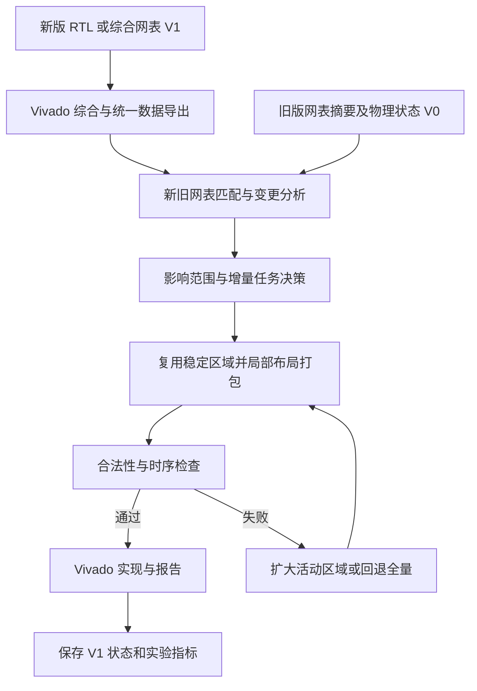

# 课题三：增量编译器工作梳理

整理日期：2026-09-25。依据：用户指定的 `/Users/jinyanglyu/Documents/课题三final.pdf`，以及 `ssh eda072` 下 `jinyang` 账号的工程只读检查。

后续更新：同日已对 faceDetect 做隔离预检，DCP 成功加载，但当前账号下的 Vivado 2024.2 实现许可检查失败。详见[服务器 case 可运行性核查](/Users/jinyanglyu/Documents/ChatGPT/增量编译器和布尔处理器/AMFplacer3.0/docs/research/server-case-audit.md)；下文初始盘点中的“尚未验证”状态应结合此更新阅读。

最新更新：同日按用户要求将 eda070 的许可复制到 eda072 后，Vivado 2024.2 已成功取得 Implementation / xcvu095 授权，原许可阻塞已解除。完整 AMFPlacer case 仍待重跑，详见上述核查记录末节。

本文区分三种内容：**说明书提出的方向、当前工程已观察到的能力、建议新增的实现**。本次完成需求与工程梳理，没有修改服务器源码，也没有重新运行布局布线；历史结果不代表当前版本已经通过验证。

## 1. 本次范围与目标

结合用户指定的 AMFPlacer 工程，暂以 **子课题 3.2「支持增量编译的 FPGA 编译器」** 为主线；用户尚未明确是否同时要求实现 3.1，因此布尔处理器编译器仅作为系统背景与后续接口考虑。

| 子课题 | 说明书内容 | 本次工作定位 |
| --- | --- | --- |
| 3.1 布尔处理器增量编译器 | Sphinx，网表重映射、处理器阵列划分、调度和指令生成；第 9–12 页 | 独立编译后端，暂不列入 AMFPlacer 实施主线 |
| 3.2 FPGA 增量编译器 | 面向多芯粒 FPGA 的变更分析、增量控制、布局、打包、时序和资源优化；第 12–15 页，图 6 | 本次主线 |
| 3.3 全可视验证 | FPGA 固件、Linux runtime、波形捕获恢复；第 15–18 页 | 暂不列入本轮开发范围 |

目标可表述为：对设计 V0 完成一次全量实现并保存状态；设计迭代为 V1 后，识别变化及其影响范围，复用仍然有效的布局和打包结果，局部重新优化，将结果送回 Vivado 完成实现，并证明相对 V1 全量编译节省了时间且质量可接受。

这里要区分四个层次：网表版本间增量编译、一次布局过程中的增量打包、同一设计的检查点恢复、Vivado 后端的增量布局布线。各层可以结合，但必须分别记录复用范围与耗时。

## 2. 如何理解说明书

这份文件是年度总结和设计方案，不是完备的软件需求规格。第 2–3 页概述使用了“实现”等措辞，而第 13–15 页多处仍写“计划”；因此实现状态必须由代码和实验确认。

3.2 的完整方向包括：

1. 从商业综合、技术映射结果读取网表、器件资源和约束。
2. 用聚类、划分、资源估计和拓扑优化进行多芯粒初始分配。
3. 增量控制器根据设计变化确定重编译范围和任务依赖。
4. 各芯粒进行时序驱动粗布局、单元扩散和资源供需调整。
5. 完成全局打包、合法化与详细布局。
6. 结合时序模型、增量打包、障碍感知扩散和锚点插入迭代优化。
7. 导回商业工具，完成布线、物理优化和比特流生成。

图 6 中包含迭代与反馈关系，实施时需要明确每一轮的数据状态和失效条件。

文档没有给出 3.2 可直接采用的数值验收门槛。第 2 页的 1500–3300 倍加速属于布尔处理器相关工作，不能作为本 FPGA 编译器的目标或已有结果。

术语校正：第 14 页将 SLL 写成“开关/查找表/逻辑”不适用于此处。多芯粒互连语境下 SLL 是 Super Long Line，用于 SLR 间连接。依据：[AMD UG949](https://docs.amd.com/r/en-US/ug949-vivado-design-methodology/SSI-Technology-Considerations)。

## 3. 已检查到的工程基础

### 3.1 本地与服务器

| 项目 | 已确认情况 |
| --- | --- |
| 本地工作目录 | `/Users/jinyanglyu/Documents/ChatGPT/增量编译器和布尔处理器` |
| 本地内容 | PDF、research 资料；尚无 AMFPlacer 源码副本 |
| 服务器连接 | `ssh eda072`，实际主机名 `ee4e072`，登录用户 `jinyang` |
| 服务器用户目录 | `/Projects/jinyang` |
| AMFPlacer 源码 | `/Projects/jinyang/AMF-Placer` |
| 已有实验结果 | `/Projects/jinyang/AMF_Results`，包含 13 个一级结果/工程目录 |
| 布线脚本与日志 | `/Projects/jinyang/amf_routing` |
| 当前源码提交 | `179f9658b15c607c7e21535794b7919eff7d9b69`，detached HEAD |
| 已有可执行程序 | `/Projects/jinyang/AMF-Placer/build/AMFPlacer`；`ldd` 未发现缺失库，尚未重新构建或运行基准 |
| 已核验 Vivado | `/Projects/Xilinx/Vivado/2024.2/bin/vivado -version` 返回 2024.2；非交互 SSH 默认 PATH 中没有 vivado |

服务器当前已检查到的是一个 AMFPlacer 源码仓库和多组实验结果，不能仅凭结果目录名把它们认定为多个可独立构建的源码版本。

本地同名 PDF 与用户指定 PDF 的字节不同；逐页提取文本仅第 4、6、14、16 页有差异，第 14 页所见差异为空格。本文始终以用户明确指定的文件为依据。

### 3.2 可复用能力与缺口

下表的源码位置均相对于远端 `/Projects/jinyang/AMF-Placer`。

| 能力 | 当前证据 | 对增量编译的意义 |
| --- | --- | --- |
| 网表、器件读取 | `designInfo/DesignInfo.*`、`deviceInfo/DeviceInfo.*`、`benchmarks/vivadoScripts/` | 可复用；需补充稳定匹配信息、逻辑参数和约束摘要 |
| 聚类与初始布局 | `ClusterPlacer.*`、`GraphPartitioner.*`、`SAPlacer.*` | 可作为分区和初始化基础；未确认有实际 SLR 约束 |
| 全局布局与扩散 | `GlobalPlacer.*`、`WirelengthOptimizer.*`、`GeneralSpreader.*` | 可扩展活动区域、冻结对象和边界约束 |
| 打包和合法化 | `InitialPacker.*`、`IncrementalBELPacker.*`、`ParallelCLBPacker.*`、`legalization/` | 已有算法基础，需支持冻结 CLB/宏的资源占用与局部修复 |
| 时序分析 | `PlacementTimingInfo.*`、`PlacementTimingOptimizer.*` | 可复用，需梳理网表改变后的时序图失效与重建 |
| 检查点 | `PlacementInfo::dumpPlacementUnitInformation/loadPlacementUnitInformation` | 可参考数据结构，不能直接视为跨版本缓存 |
| Vivado 导出 | `ParallelCLBPacker::dumpPlacementTcl` | 现有全量导出路径需要增量适配 |
| 跨版本增量控制器 | 本次检查的主流程和核心源码中未定位到 | 需要新增变化分析、状态复用、调度、回退 |
| 多芯粒资源/SLL 模型 | 核心源码中搜索 SLR/SLL/multi-die/cross-die 未定位到明确实现 | 需要补充器件拓扑、边界资源与跨芯粒代价 |

### 3.3 会直接影响设计的事实

**检查点依赖原编号。** `src/lib/HiFPlacer/placement/placementInfo/PlacementInfo.cc:1877–1880` 按 `cellId` 取单元并断言名字一致。新增、删除、重新排序单元后，旧编号可能失效。需要建立跨版本对象映射，不能直接加载旧文件后继续运行。

**现有导出会清空布局。** `src/lib/HiFPlacer/placement/packing/ParallelCLBPacker.cc:3179` 生成 `place_design -unplace`，末尾第 3209 行调用全局 `place_design` 和 `route_design`。要宣称后端布局/布线复用，必须调整这条路径并实际测量复用情况。

**导出信息不足以完整识别逻辑变化。** `benchmarks/vivadoScripts/extractNetlist.tcl` 导出单元类型、引脚、连线和驱动端，未见 LUT INIT 等功能参数的导出。例如 LUT 真值表改变而名字、连线不变，现有信息可能无法识别。需要区分“逻辑已改变”与“仍可复用物理位置”。

**现有主要目标是单芯粒器件。** OpenPiton 工程指定 `xcvu095-ffva2104-2-e`；digitRecognition 的历史布线报告也使用 xcvu095。AMD 将 VU095 列为 monolithic device，因此这些案例能验证增量机制，但不能证明真实的多芯粒 SLL 优化。依据：[AMD UG583](https://docs.amd.com/r/en-US/ug583-ultrascale-pcb-design/13.-Migration-Scenarios)。

**必须保留现有工作。** 远端有 3 个已跟踪文件的未提交修改（网表输入处理及打包评分），另有未跟踪 `MLTimingModel.cc/.h` 和输出目录。本次没有修改它们。正式开发前应保存包含这些内容的基线快照，并明确是否将这些实验改动纳入基线；直接从 HEAD 建分支或 worktree 不会自动带上未提交改动。

**历史环境不能等同当前环境。** 2026-03-27 的 `digitRecognition_cons5.log` 有 Implementation/xcvu095 许可证失败；2026-03-28 的另一个报告标注 Vivado 2023.2 和 Routed，说明也存在历史成功结果。当前核验的是 2024.2 可启动，当前许可证和整条流程尚未验证。

## 4. 建议的软件结构

建议新增或扩展以下模块，名字仅为工作规划，尚未创建：

| 模块 | 主要职责 |
| --- | --- |
| `DesignSnapshot` / `CheckpointStore` | 保存规范化网表摘要、对象映射、Site/BEL、宏与打包状态、约束/器件/工具版本及缓存格式版本 |
| `NetlistDiff` | 匹配新旧对象，识别新增/删除/功能参数变化/连线变化/约束变化，并记录匹配置信度 |
| `ImpactAnalyzer` | 结合逻辑邻域、宏、CLB、时钟、拥塞和关键路径产生必须重算与允许放松的对象集合 |
| `IncrementalController` | 决定全量或增量模式，调度依赖任务，记录阶段耗时、扩大范围原因和回退原因 |
| AMFPlacer 局部优化接口 | 恢复有效位置、占用冻结资源、限制移动，执行局部布局和合法化；维护所有派生索引的一致性 |
| 多芯粒扩展 | Site/SLR 映射、分区容量、边界 SLL 供需与延迟模型、并行子任务和边界协调 |
| Vivado 适配层 | 导出布局/约束，控制是否复用参考 DCP，校验导入结果并收集最终实现报告 |

匹配初期采用保守策略：层次名、类型、功能参数、引脚连接和结构共同判断；不确定的匹配重新处理。功能相同和位置可复用是两个判断，不能混为一个布尔标记。

变化影响范围也不能简单等同于整个扇出锥：逻辑差异检测需要传播，而物理重放置应结合资源与时序逐步扩大。建议采用“冻结区、缓冲区、活动区”，允许质量反馈触发扩大范围。

## 5. 分阶段工作与完成标准

| 阶段 | 工作 | 完成标准 |
| --- | --- | --- |
| M0 可复现基线 | 保存当前源码及未提交改动；独立构建目录；参数化输入输出路径；固定工具版本；验证完整单例流程 | 一个小案例完成网表导出、AMFPlacer、Vivado 布线与报告；代码、输入、命令、日志可追溯 |
| M1 变更识别与状态存储 | 扩展必要导出字段；新旧网表规范化；对象匹配；缓存版本与兼容性校验 | 无变化、重排、改参数、增删单元、改连线等案例得到预期差异；不安全缓存被拒绝 |
| M2 单芯粒增量布局闭环 | 复用位置/宏/打包；局部活动集合；冻结资源占用；局部合法化；范围扩大与全量回退 | V1 从 V0 状态出发完成布局；冻结对象保持预期状态；合法化成功；能与 V1 全量结果比较 |
| M3 后端实现与复用验证 | 调整 Tcl 导出；用新版网表完成 Vivado 实现；单独接入/验证参考 DCP 复用 | 导入、布线及 DRC 状态可检查；分别报告 AMF 布局复用、Vivado 复用和端到端耗时 |
| M4 多芯粒扩展 | 确认器件和数据；提取拓扑、容量和时延；划分、并行布局、SLL 感知优化 | 在真实多 SLR 器件设计上完成实现，输出跨边界连接、资源分布、拥塞与时序对比 |
| M5 评估与交付 | 完整实验矩阵、消融实验、失败案例、复现脚本、用户说明 | 形成可重复的速度/质量结论及可运行编译器入口 |

顺序建议为 M0 → M1 → M2 → M3；多芯粒目标数据的准备从 M0 开始，核心多芯粒优化在单芯粒增量闭环稳定后推进。M4 是覆盖说明书完整 3.2 方向所必需的阶段，M2 只是最小可用原型。

M0 中不要直接执行现有 `build.sh`：它包含清理已有 build 目录的操作。建议新增独立构建和运行目录，保留原二进制与历史结果。

M2/M3 初期可以用全量布线验证局部布局的可用性，但必须标注为“增量布局 + 全量后端”。Vivado 自带增量实现有独立的参考设计复用机制，应作为单独接入项和对照项，具体选项以安装的 2024.2 帮助为准。[AMD UG904](https://docs.amd.com/r/en-US/ug904-vivado-implementation/Incremental-Implementation)

## 6. 验证与实验口径

所有对比都应针对同一个修改后的设计 V1，保持器件、时钟约束、线程数、工具版本和物理优化设置一致；V0 仅提供参考状态。首次全量编译成本与后续迭代成本分别记录。

| 类别 | 建议案例或指标 |
| --- | --- |
| 变更类型 | 无变化；仅输入排序/命名变化；LUT INIT 变化；增加/删除/替换单元；连线变化；局部 RTL 修改；时钟或约束变化 |
| 变更规模 | 单单元、单模块及多个修改比例；1%、5%、10% 可作为实验档位，属于建议而非课题硬性指标 |
| 对照 | 修改后设计的全量 AMFPlacer 流程；本方法增量流程；条件允许时加入 Vivado 全量和原生增量流程 |
| 正确性 | 新版网表完整性、对象映射、物理约束满足、Site/BEL 合法性、DRC、布线完成状态；必要时做网表等价或功能仿真 |
| 编译时间 | 综合、导出、匹配、局部布局、打包、后端、总墙钟时间；另外记录 CPU/内存及传输时间 |
| 增量效果 | 稳定对象匹配率、位置复用率、活动集合大小、移动距离、宏/CLB 重打包量、回退次数和原因 |
| 设计质量 | 布线后 WNS/TNS、关键路径时延、资源使用、拥塞与布线成功率 |
| 多芯粒质量 | 每 SLR 各类资源利用率、跨 SLR 连接及实际 SLL 使用/分布、跨界关键路径 |

布局阶段加速与端到端加速分别计算。仅有低线长、局部 STA 改善或 AMFPlacer 成功退出，不能作为完整实现通过的证据。变更比例的分母、复用率的对象单位和全量回退是否计入结果都要在报告中写清楚。

验收门槛应在 M0 获得基线后确定，包括允许的质量变化、最低加速目标、必须通过的案例与失败回退要求；现阶段不虚构承诺。

## 7. 本地与服务器协作方式

- 本地保存开发源码、方案、实验清单、轻量摘要与图表，便于审查和版本管理。
- 服务器承担 Linux 构建、Vivado、布局布线及大型数据；每次实验使用独立目录和唯一运行标识。
- 同步明确的源码/脚本路径，不对整个用户目录或历史结果进行覆盖式同步。
- 每次运行记录源码提交与本地补丁摘要、输入哈希、器件、工具版本、参数、随机种子（如有）、线程数、输出目录及退出状态。
- 先保存用户已有修改，再建立 `codex/` 开发分支；本地与远端采用明确的提交/补丁同步方式，避免同时修改两份未跟踪的源码。

## 8. 下一步最先处理的事项

1. 确定当前改动作为基线的保存方式，特别是时序打包改动和未跟踪 ML 模型文件。
2. 用独立目录复现一个小案例，确认 Vivado 2024.2 的许可证、输入路径和导入兼容性。
3. 准备同一设计的 V0/V1 成对数据，优先使用可明确核对变化的最小电路，再接入现有大设计。
4. 定义 `DesignSnapshot` 与 `NetlistDiff` 数据格式，实现只读变更报告；之后再修改布局内核。
5. 查明可用的多 SLR 目标器件、器件数据库和真实设计输入，避免直到后期才发现缺少数据。

实施前仍需确定的项目条件：3.1 是否纳入范围、多芯粒目标型号、可用 RTL/综合 DCP、最终交付是否必须含 bitstream/上板验证、时间节点和量化指标。这些条件不妨碍先完成 M0 与 M1 的准备。
